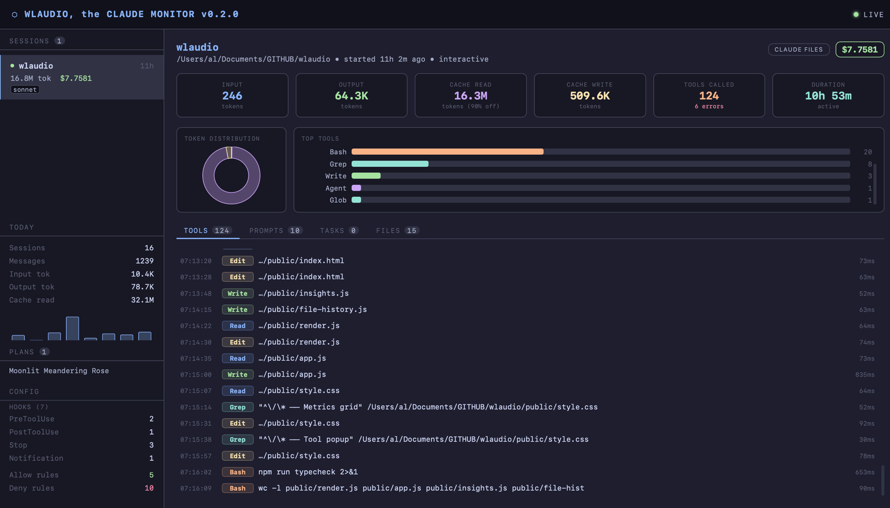

# Wlaudio

**Real-time web frontend for monitoring Claude Code sessions.**

Wlaudio reads directly from `~/.claude/` and streams live data to a browser dashboard — no agents, no API calls, no instrumentation needed. Start it alongside Claude Code and watch your sessions unfold.



---

## What it shows

| Panel | Data |
|-------|------|
| **Sessions sidebar** | All active Claude Code processes, age, project name, token count, estimated cost, model badges |
| **Token metrics** | Input / Output / Cache-read / Cache-write tokens per session, updated in real time |
| **Cost estimate** | Calculated from token counts using published Anthropic pricing (Opus / Sonnet / Haiku) |
| **Tool call timeline** | Every tool call in order — `Read`, `Edit`, `Bash`, `Grep`, `Agent`, etc. — with argument preview and execution time |
| **Subagent calls** | Sidechain turns indented under their parent with `└─` connectors |
| **Token doughnut** | Chart.js breakdown of token type distribution per session |
| **Top tools bar chart** | Frequency ranking of tools called, colour-coded by type |
| **Global sparkline** | 14-day message activity bar chart from `stats-cache.json` |

---

## Quick start

```bash
git clone git@github.com:alvagante/wlaudio.git
cd wlaudio
npm install
npm run dev
```

Open **http://localhost:4242** — the dashboard connects automatically and begins streaming any active Claude Code sessions.

### With a custom port

```bash
PORT=8080 npm run dev
```

---

## How it works

```
~/.claude/sessions/*.json        ← active PIDs + session IDs
~/.claude/projects/**/*.jsonl    ← per-turn conversation history
~/.claude/stats-cache.json       ← aggregated usage stats
```

1. **Watcher** (`src/watcher.ts`) — [chokidar](https://github.com/paulmillr/chokidar) watches `~/.claude/sessions/` for process changes. Every 2 seconds it tail-reads any active `.jsonl` files for new turns.
2. **Parser** (`src/parser.ts`) — Parses JSONL turns, extracts tool calls with timing, computes token totals, and estimates cost.
3. **Server** (`src/server.ts`) — Express serves `public/` as static files. A WebSocket endpoint at `/ws` broadcasts parsed events to all connected clients.
4. **Frontend** (`public/app.js`) — Vanilla JS with Chart.js (CDN). Reconnects automatically on disconnect. No build step.

---

## Cost model

Costs are estimated from token counts using these rates (USD per million tokens):

| Model | Input | Output | Cache read | Cache write |
|-------|-------|--------|------------|-------------|
| claude-opus-4-6 | $15 | $75 | $1.50 | $18.75 |
| claude-sonnet-4-6 | $3 | $15 | $0.30 | $3.75 |
| claude-haiku-4-5 | $0.80 | $4 | $0.08 | $1.00 |

`costUSD` in Claude Code's own stats is always `0` — Wlaudio calculates it client-side from token counts.

---

## Project structure

```
wlaudio/
├── src/
│   ├── types/index.ts   TypeScript interfaces
│   ├── parser.ts        JSONL reader + stats calculator
│   ├── watcher.ts       chokidar file watcher + EventEmitter
│   ├── server.ts        Express + WebSocket server
│   └── index.ts         Entry point, graceful shutdown
├── public/
│   ├── index.html       Single-page shell, loads Chart.js from CDN
│   ├── style.css        Catppuccin Mocha dark theme, CSS Grid layout
│   └── app.js           WebSocket client, state, Chart.js integration
└── scripts/
    └── db-query.ts      Dev query runner (StrictDB pattern)
```

---

## Development

```bash
npm run dev          # Start with tsx watch (hot-reload on src/ changes)
npm run typecheck    # tsc --noEmit
npm run test         # vitest unit tests
npm run build        # compile to dist/
```

TypeScript strict mode is on (`noUncheckedIndexedAccess`, `noImplicitOverride`). No `any`.

---

## Requirements

- **Node.js** ≥ 20
- **Claude Code** installed and has been used at least once (so `~/.claude/` exists)
- macOS or Linux (reads `~/.claude/` — Windows not tested)

---

## License

MIT
