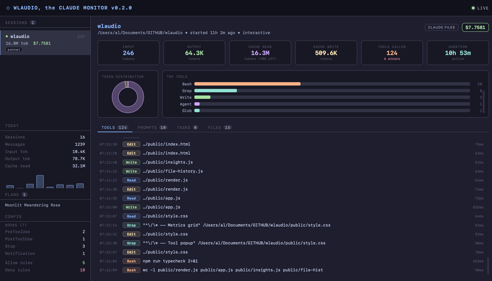

# Wlaudio

**Real-time web frontend for monitoring Claude Code sessions.**

Wlaudio reads directly from `~/.claude/` and streams live data to a browser dashboard — no agents, no API calls, no instrumentation needed. Start it alongside Claude Code and watch your sessions unfold.



---

## What it shows

### Session dashboard (`/`)

| Panel | Data |
|-------|------|
| **Sessions sidebar** | Active + up to 15 recently ended sessions; age, project, token count, estimated cost, model badges, outcome badge, and opening prompt for ended sessions |
| **Token metrics** | Input / Output / Cache-read / Cache-write tokens per session, with error count on tool calls |
| **Cost estimate** | Per-session and per-model cost calculated from token counts; hover the badge for a model breakdown |
| **First prompt card** | The opening user message of the session, shown above the AI summary |
| **AI summary card** | Goal, outcome, helpfulness rating, friction indicator, and brief summary auto-generated by Claude at session end |
| **Code impact row** | Lines added/removed, files modified, git commits/pushes, languages used, user interruptions |
| **Activity hours** | 24-slot bar chart showing which hours of the day the user was active in the session |
| **Token doughnut** | Chart.js breakdown of token type distribution per session |
| **Top tools bar chart** | Frequency ranking of tools called — click any bar to see all calls for that tool with full input, duration, and output |
| **Tool call timeline** | Every tool call in order with argument preview and timing — click any row for full detail popup |
| **Files tab** | All files touched in the session grouped by path; Edit calls show before/after diff blocks, Write calls show full content |
| **Prompts tab** | Every user prompt sent during the session from `history.jsonl` |
| **Tasks tab** | Live todo list tracked by Claude during the session |
| **CLAUDE FILES button** | View all config files affecting the session (global + project `CLAUDE.md`, `settings.json`, `settings.local.json`) with full filesystem paths; works for active and ended sessions |
| **Global sparkline** | 14-day message activity bar chart from `stats-cache.json` |

### MDD Dashboard (`/mdd.html`)

Requires MDD to be installed globally (`~/.claude/commands/mdd.md`). Reads `.mdd/` from the project root.

| Panel | Data |
|-------|------|
| **Status bar** | Doc counts by drift state: in-sync · drifted · broken ref · untracked |
| **Docs list** | Feature docs with drift badge and phase; click to read full content |
| **Audits list** | Audit reports by type (report · scan · flow · notes); click to read |
| **Dependency graph** | Visual `depends_on` graph from MDD frontmatter |

### Session Timeline (`/timeline.html`)

Chronological stream view of any session — select a session from the sidebar, then browse every user message and tool call in order. Filter by errors, user messages, and tool calls independently.

### Terminal page (`/terminal.html`)

| Feature | Detail |
|---------|--------|
| **Interactive shell** | PTY-backed terminal (via `node-pty`) rendered with xterm.js; opens a login shell and auto-runs `claude` |
| **Multi-tab** | Open unlimited terminal tabs; each shows the project directory name |
| **Project selector** | Pick a working directory from your project list or type any path; deep-linkable via `?cwd=` |
| **Resize** | Terminal reflows to fill available space automatically |
| **Security** | Enabled by default; set `TERMINAL_ENABLED=0` to disable; restricted to localhost origins |

### Analytics page (`/analytics.html`)

| Panel | Data |
|-------|------|
| **Summary cards** | Total sessions, total messages, first-use date, longest session with duration and message count |
| **Activity by hour** | Bar chart of message frequency across all 24 hours — shows when you actually code |
| **Session outcomes** | Doughnut chart of achieved / mostly achieved / partial / not achieved across all sessions |
| **Languages worked in** | Horizontal bar chart of the top 12 languages by file count, aggregated across all sessions |
| **Model usage & cost** | Table of token counts and estimated cost per model, with totals |

### Sessions page (`/sessions.html`)

Full-page session browser — same sidebar and detail view as the dashboard, without the analytics nav clutter.

### Projects page (`/projects.html`)

Aggregated view per working directory. Select a project to see session count, total tokens, git commits, lines added/removed, top languages, outcome doughnut, and a list of every session. Sort by most recent, session count, commits, or lines changed.

### Configs page (`/configs.html`)

Reads global and per-project `settings.json` files and renders MCP servers, hooks (grouped by event and matcher), allow/deny permission rules, and model overrides. Project cards show hook and rule counts at a glance. A files panel lets you browse `CLAUDE.md`, `settings.json`, hook scripts, skills, and commands per project.

### Themes page (`/themes.html`)

Live theme picker with 17 colour schemes — Catppuccin variants, Tokyo Night, Gruvbox, Nord, Dracula, Solarized, GitHub Light, and more. Click to apply; choice persists in `localStorage`.

### Learning Mode

A "Learn Mode" toggle in the sidebar (available on all pages) activates hover tooltips and click-to-expand detail panels for every major UI element. Useful for understanding what each metric means. Preference persists in `localStorage`.

---

## Quick start

```bash
git clone git@github.com:alvagante/wlaudio.git
cd wlaudio
npm install
npm run dev
```

Open **http://localhost:4242** — the dashboard connects automatically and begins streaming any active Claude Code sessions.

### With a custom port

```bash
PORT=8080 npm run dev
```

### Disable the terminal

```bash
TERMINAL_ENABLED=0 npm run dev
```

The terminal page (`/terminal.html`) is **enabled by default**. It spawns a login shell via `node-pty` restricted to localhost origins — set `TERMINAL_ENABLED=0` if you want to disable it (e.g. when sharing the port on a non-trusted network).

---

## Docker (no local install required)

Pull the pre-built image from Docker Hub and run it — no git clone, no npm, no compilation:

```bash
docker run --rm -p 4242:4242 \
  -v "${HOME}/.claude:/root/.claude:ro" \
  -e HOME=/root \
  lab42it/wlaudio:latest
```

Or with Docker Compose — save a `docker-compose.yml` with:

```yaml
services:
  wlaudio:
    image: lab42it/wlaudio:latest
    ports:
      - "4242:4242"
    volumes:
      - "${HOME}/.claude:/root/.claude:ro"
    environment:
      - HOME=/root
      - TERMINAL_ENABLED=0
```

Then run:

```bash
docker compose up
```

Open **http://localhost:4242** — the dashboard reads your `~/.claude/` via a read-only volume mount. Nothing is installed on your host system.

**What's available in Docker mode:**

| Feature | Available |
|---------|-----------|
| Session dashboard, analytics, timeline | Yes |
| Projects, configs, themes, MDD | Yes |
| Terminal page (`/terminal.html`) | No — PTY spawning is disabled inside containers |

The terminal feature requires spawning a shell with access to your host's `PATH` and `claude` binary, which is not practical inside a container. All other features work identically.

**Building from source** (if you want to customise the image):

```bash
git clone git@github.com:alvagante/wlaudio.git
cd wlaudio
docker build -t wlaudio .
docker run --rm -p 4242:4242 -v "${HOME}/.claude:/root/.claude:ro" -e HOME=/root wlaudio
```

---

## How it works

```
~/.claude/sessions/*.json        ← active PIDs + session IDs
~/.claude/projects/**/*.jsonl    ← per-turn conversation history
~/.claude/stats-cache.json       ← aggregated usage stats
```

1. **Watcher** (`src/watcher.ts`) — [chokidar](https://github.com/paulmillr/chokidar) watches `~/.claude/sessions/` for process changes. Every 2 seconds it tail-reads any active `.jsonl` files for new turns.
2. **Parser** (`src/parser.ts`) — Parses JSONL turns, extracts tool calls with timing, computes token totals, and estimates cost.
3. **Server** (`src/server.ts`) — Express serves `public/` as static files. A WebSocket endpoint at `/ws` broadcasts parsed events to all connected clients and handles terminal I/O messages.
4. **Terminal** (`src/terminal.ts`) — `TerminalManager` wraps `node-pty` to spawn, resize, and kill PTY processes; emits `output` and `exit` events picked up by the WebSocket layer. Enabled by default; set `TERMINAL_ENABLED=0` to disable.
5. **Frontend** (`public/app.js`) — Vanilla JS with Chart.js (CDN). Reconnects automatically on disconnect. No build step.

---

## Cost model

Costs are estimated from token counts using these rates (USD per million tokens):

| Model | Input | Output | Cache read | Cache write |
|-------|-------|--------|------------|-------------|
| claude-opus-4-6 | $15 | $75 | $1.50 | $18.75 |
| claude-sonnet-4-6 | $3 | $15 | $0.30 | $3.75 |
| claude-haiku-4-5 | $0.80 | $4 | $0.08 | $1.00 |

`costUSD` in Claude Code's own stats is always `0` — Wlaudio calculates it client-side from token counts.

---

## Project structure

```
wlaudio/
├── src/
│   ├── types/index.ts   TypeScript interfaces
│   ├── parser.ts        JSONL reader + stats calculator
│   ├── watcher.ts       chokidar file watcher + EventEmitter
│   ├── server.ts        Express + WebSocket server
│   ├── terminal.ts      PTY manager (node-pty wrapper)
│   ├── mdd.ts           MDD dashboard builder (docs, audits, graph, drift)
│   ├── mdd-parse.ts     MDD frontmatter parser
│   ├── data.ts          Loaders for history, todos, plans, meta, facets
│   └── index.ts         Entry point, graceful shutdown
├── public/
│   ├── index.html       Session dashboard
│   ├── sessions.html    Sessions browser
│   ├── analytics.html   Cross-session analytics
│   ├── projects.html    Per-project aggregates
│   ├── configs.html     Settings viewer (MCP, hooks, permissions, files)
│   ├── themes.html      Theme picker
│   ├── terminal.html    Browser terminal (xterm.js + node-pty)
│   ├── timeline.html    Session timeline (messages + tool calls)
│   ├── mdd.html         MDD dashboard (docs, audits, graph)
│   ├── app.js           WebSocket client + state
│   ├── dashboard.js     Dashboard rendering
│   ├── render.js        Metrics, charts, tool timeline, popups
│   ├── insights.js      AI summary card, activity hours
│   ├── file-history.js  Files tab: diff view
│   ├── sidebar.js       Session list, global stats, plans
│   ├── analytics.js     Analytics charts and tables
│   ├── projects.js      Projects page
│   ├── configs.js       Configs page
│   ├── terminal.js      Terminal page (xterm.js client)
│   ├── timeline.js      Timeline page
│   ├── mdd.js           MDD page entry point
│   ├── mdd-render.js    MDD rendering (status bar, lists, graph, detail)
│   ├── mdd-state.js     MDD page state
│   ├── nav.js           Shared sidebar nav (all pages)
│   ├── learning.js      Learning mode (tooltips + detail panels)
│   ├── theme.js         Theme loader (no-flash)
│   ├── utils.js         Shared formatters and helpers
│   ├── shared.css       Shared palette, sidebar layout, utilities
│   ├── style.css        Base dark theme (Catppuccin Mocha)
│   ├── themes.css       17 theme overrides
│   ├── analytics.css    Analytics page styles
│   ├── projects.css     Projects page styles
│   ├── configs.css      Configs page styles
│   ├── terminal.css     Terminal page styles
│   ├── timeline.css     Timeline page styles
│   ├── mdd-layout.css   MDD page layout
│   └── mdd-components.css MDD component styles
└── docs/
    └── screenshot.png
```

---

## Development

```bash
npm run dev          # Start with tsx watch (hot-reload on src/ changes)
npm run typecheck    # tsc --noEmit
npm run test         # vitest unit tests
npm run build        # compile to dist/
```

TypeScript strict mode is on (`noUncheckedIndexedAccess`, `noImplicitOverride`). No `any`.

---

## Requirements

- **Node.js** ≥ 20
- **Claude Code** installed and has been used at least once (so `~/.claude/` exists)
- macOS or Linux (reads `~/.claude/` — Windows not tested)

---

## License

MIT
